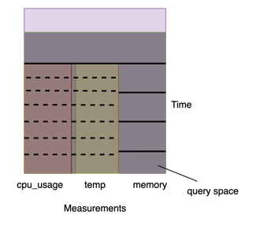
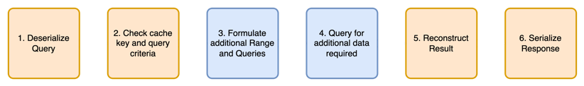

# TSAgg Cache

## Abstract
Time-series databases are the backbone to modern monitoring systems. While time-series databases are typically optimized for fast reads, the increasing number of users of these databases and the need to analyze large amounts of correlated time series prompts the need for an efficient solution to reduce load on time series databases. We present TSAggCache, a platform-agnostic, in-memory caching solution which exploits the similarities in time-series queries, as well as the properties of aggregated time-series data to improve read performance of time-series queries and reduce the load on time-series databases. We have developed a translation DSL, efficient cache indexing structure, and layout which allows the re-use of cached data over multiple dimensions. Our experiments show that TSAggCache can significantly improve client query performance, reducing latency by up to 91% while providing correctness guarantees.

## Problem

Time series data is huge, with Twitter's Observability stack collecting 170 million metrics every minute and serving 200 million queries per day. Time series databases are typically used for metrics and log storage for large systems and applications, and are typically append-only (due to the historical nature of the data)
One common use of Timeseries data is dashboarding, where users are able to create visualizations to track specific metrics over time.

However, many clients achieve this by simply re-querying data repeatedly or on startup. This repeated queries can put a strain on the time series database by repeatedly querying and aggregating the same data over and over again, which is not required in most cases.

## Components 
We propose a cache layer in-between the Time Series database which allows for re-use of previously aggregated results and reduces the amount of queries the database needs to handle.
We provide the following:

### Query DSL
TSAggCache utilizes an internal DSL to build and process queries. This allows us to extend the functionality of TSAggCache, allowing it to be used as a cache for other Time-Series database implementations such as Prometheus and Timescale DB in future. We achieve this by providing an extensible DSL which provides abstractions for core features of time series queries such as measurements, filters, tags, and aggregation functions. This allows us to translate queries between different languages and serialization formats, such as from FluxQL to InfluxQL and to JSON. This allows us to build queries using a unified DSL for multiple platforms.

### Cache Server
The server is implemented using a simple Python Flask server, which supports 3 main endpoints 
```
GET /api/health -> Performs healtcheck on cache service
POST /api/reset -> Clears all data in the cache
POST /api/query -> Queries data in the cache
```

## TSAggCache Usage

1. The TS Aggregation Cache is built on-top of a key-value system.
2. The main idea of this design is to store a materialized view of a previous query in-memory, and check to see which parts of the query we can reuse.

    - This results in a smaller query needed to be made to the Time Series database in the case of a partial hit
    - In the case of a complete cache hit, we can simply manipulate the existing data we have in the cache to return the result to the user.
3. The cache works in these rough steps to produce the output required



## Running the Cache / Experiments

### Dependencies
```
pip install influxdb3-python
pip install pandas
pip install flask
```

### Starting the TestServer:
```
python3 influxv3/testServer.py
```

### Provide configs for Influx Connection
Modify the cacheConfig.ini file, providing token, org and host
```
[influx]
token="" #Replace "" with token
org="" #Replace "" with org name
host="" # Replace "" with hostname of influx server
```
### Running the test data generation
```
python3 influxv3/testDataGen3.py
```
### Construct queries using the query DSL
```
from influxv3.queryDSL import InfluxQueryBuilder, QueryAggregation, QueryFilter

queryBuilder = (InfluxQueryBuilder()
               .withBucket("Test")
               .withMeasurements(["cpu_usage", "temperature"])
               .withTable("system_metrics")
               .withFilter(QueryFilter("platform", "mac_os").OR(QueryFilter("platform", "windows")))
               .withAggregate(QueryAggregation("10m", "mean", False))
               .withRelativeRange('300m', None)
               .withGroupKeys(["host", "platform"])
       )
```

### Convert Query DSL to JSON request and send request to server
```
requestJson = queryBuilder.buildJson()
response = requests.post(cacheUrlJson, json=queryJson)
```


## Utilities

### Cache Structure
We construct the cache as a Key-Value store, with each value stored as a tree. Each value is indexed by the constructed key using the hard filters based on a combination of the table, aggregation function and hard filters.

### Measurements and Tracing
We provide tracing of operations to profile the time taken for each operation in the cache. This can be activated by providing argument `queryBuilder.buildJson(doTrace=True)` when building the request Json. The response object will contain a json which details the time taken for each operation in the cache.

### Paper
A writeup for the implementation details of the cache can be found [here](/TsAggCachePaper.pdf)
